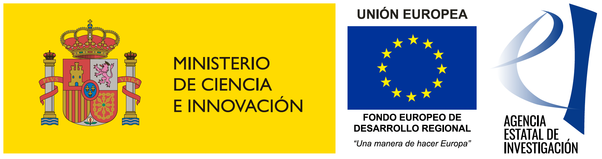

# Funding, ethics and procedures for data use {#etica}

## Funding

The SOGEDI survey has been funded by two research projects led by [Gloria Jiménez-Moya](https://www.psicologia.uc.cl/persona/gloria-jimenez-moya/) and [Mario Sainz](https://www.ugr.es/personal/mario-sainz-martinez). The use of resources associated with this survey (data, codes, repositories) in scientific publications, books, presentations, outreach materials, or any other products that utilize or mention the SOGEDI survey must include the mandatory reference to the following projects. The reference text should be as follows:

"Antecedents, Manifestations, and Consequences of Ambivalent Classism" (PID2022-136736NA-I00) an I+D+I project funded by MCIN/AEI/10.13039/501100011033/ and FEDER "A way to make Europe" granted to Mario Sainz.

"Socioeconomic and Gender Disparities: A Multi-Country Study" a project funded by the [Centre for Social Conflict and Cohesion Studies -- COES](https://coes.cl/) (ANID/FONDAP/1523A0005) granted to Gloria Jiménez-Moya.

In addition, the reference to the data that must be included is as follows:

*Sainz, M. & Jiménez-Moya, G. (2025). Socioeconomic and gender disparities: A multi-country study (SOGEDI-COES). \[Data set and code book\]. Retrieved from [osf.io/nv6rs](osf.io/nv6rs)*

## Ethics Committee Approval

The SOGEDI project was submitted for ethical approval by the ethical project evaluation committee of the Universidad Nacional de Educación a Distancia (UNED). According to the certification obtained, the project meets all the suitability requirements established by this Committee for research involving human participants. The ethical approval reference for this project is as follows: 11-SISH-PSI-2024.

## Permission for the use of SOGEDI Survey Data

To use the SOGEDI survey data, the following steps must be followed:

1.  **Request approval**: Submit a formal request detailing the intended use of the data, including the research objectives, methodology, and expected items to use. This step is important to ensure that the team leading the survey can verify that different research teams are not working on the same variables or pursuing the same objectives. The request should be sent to Mario Sainz (see details below).

2.  **Mandatory citation**: In any publication, presentation, or dissemination material using the SOGEDI survey data, the official references and logos provided must be included. The SOGEDI team will not request authorship in the works; however, the institutional sources of funding must be acknowledged.

3.  **Pre-print and communication**: It is expected that, after using SOGEDI resources, the researcher who is responsible for the output---whether in the form of chapters, books, presentations, etc.---will send the SOGEDI team the full reference of the work for its inclusion in the corresponding section of this methodological document. Similarly, the researcher is expected to submit a pre-print of the completed document and provide links to institutional or private repositories where the outputs derived from the survey are stored. This process ensures that the research products based on the SOGEDI survey remain publicly accessible.

4.  **Restricted use**: The data may only be used for the approved research purposes and cannot be shared with third parties without prior authorization. The SOGEDI team adheres to open science guidelines and the proper use of public research funds. For this reason, the team does not authorize the use of the data for research outputs published in journals or publishers that do not adhere to open science principles or that are considered predatory publishers or journals.

For further inquiries or to submit a request, please contact Mario Sainz, c/ Juan del Rosal, Number 10, Madrid, Spain (email: [msainz\@psi.uned.es](msainz@psi.uned.es)).
